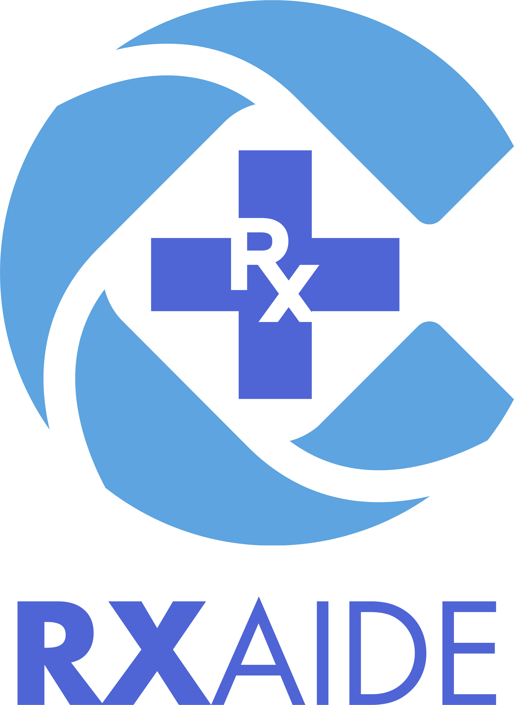

# RxAide

<p align="center">
	<!-- 
	<br /> -->
	
</p>

<p align="center">
	<b>AI-powered medication reminder and management assistant for Android.</b>
	<br />
	RxAide helps users scan prescriptions, extract medicine details with AI, auto-generate schedules,
	send reminders, and track adherence through a modern, conversational interface.
</p>

---

## APK Release

- **Latest APK (GitHub Releases):**
  https://github.com/Aminul-Islam7/rxaide-cse299/releases/latest

---

## Project Details

- **Project Group:** Group 2
- **Course:** CSE299 (Section 4)
- **Semester:** Spring 2026 (North South University)
- **Faculty Advisor:** Dr. Mohammad Shifat-E-Rabbi (MSRb)

### Group Members

| Name                    | NSU ID     | Email                                  |
| :---------------------- | :--------- | :------------------------------------- |
| Aminul Islam            | 2321169042 | aminul.islam.232@northsouth.edu        |
| Md Shahriar Rakib Rabbi | 2321937642 | shahriar.rabbi.232@northsouth.edu      |
| Tirtho Mojumdar         | 2312536042 | tirtho.mojumdar.2312536@northsouth.edu |

---

## Table of Contents

- [Project Overview](#project-overview)
- [Implemented Features](#implemented-features)
- [Architecture](#architecture)
- [Technology Stack](#technology-stack)
- [Project Structure](#project-structure)
- [Setup and Running](#setup-and-running)
- [Usage Flow](#usage-flow)
- [Screenshots](#screenshots)
- [Documentation](#documentation)
- [Current Limitations](#current-limitations)
- [Disclaimer](#disclaimer)

---

## Project Overview

Medication non-adherence is a major healthcare problem, especially for users managing multiple medicines.
RxAide addresses this by combining the full workflow in one app:

1. Capture prescription image
2. Extract medicine details with Gemini AI
3. Confirm and auto-create schedules
4. Send reliable reminders using WorkManager
5. Track taken/missed doses in adherence dashboards

The app is built as a native Android project using Kotlin, Jetpack Compose, Room, and WorkManager,
with Gemini integration for OCR + conversational medication support.

---

## Implemented Features

### 1. AI Prescription Scanning and Chat

- Prescription image capture (camera or gallery)
- Gemini-powered extraction of:
    - Medicine name
    - Dosage and unit
    - Form and frequency
    - Meal relation, duration, notes
- Conversational corrections before final confirmation
- Quick action flow: **Confirm & Schedule** and **My Medications**
- Markdown-rendered bot responses

### 2. Medication Management

- Add medication manually with rich form fields
- Edit medication and schedule details
- Delete medication with confirmation
- Optional fields support (dosage/form/instructions/notes)
- Custom notification sound selection per medication

### 3. Smart Scheduling and Reminders

- Automatic schedule creation after prescription confirmation
- Manual schedule time selection (multiple times per day)
- Reminder notifications with in-notification actions:
    - **Taken**
    - **Missed**
- Re-scheduling after device reboot
- Dose backfill worker to create missing history records

### 4. Adherence Tracking

- Overall adherence statistics (taken, missed, unmarked)
- Per-medication adherence cards
- History timeline with status badges
- Period filters:
    - All Time
    - This Month
    - This Week
    - Today

### 5. UX and Navigation

- Modern Compose UI with custom theme
- Bottom navigation with badge counts
- Directional screen transitions and pull-to-refresh sync
- Dark mode toggle in settings

---

## Architecture

RxAide follows **MVVM** with a clean separation of concerns.

### View Layer

- Jetpack Compose screens for Home, Camera, Chat, Medications, Notifications, Tracker, and Settings
- Navigation Compose-based route graph

### ViewModel Layer

- `MedicationViewModel` for medication/schedule operations
- `ChatViewModel` for chat state, AI flow, and action parsing
- `AdherenceViewModel` for adherence aggregation and filters

### Model/Data Layer

- Room database with entities:
    - `Medication`
    - `Schedule`
    - `DoseHistory`
    - `ChatMessage`
- Repository layer:
    - `MedicationRepository`
    - `ChatRepository`
- WorkManager + Receivers for reminders and action handling

---

## Technology Stack

| Area            | Technology                             |
| :-------------- | :------------------------------------- |
| Platform        | Android                                |
| Language        | Kotlin                                 |
| UI              | Jetpack Compose + Material 3           |
| Architecture    | MVVM                                   |
| Local Storage   | Room                                   |
| AI              | Google Gemini API (`gemini-2.5-flash`) |
| Background Jobs | WorkManager                            |
| Camera          | CameraX                                |
| Navigation      | Navigation Compose                     |
| Image Loading   | Coil                                   |
| Build System    | Gradle (KTS)                           |

---

## Project Structure

```text
app/src/main/java/com/example/rxaide/
	ai/                    # Gemini integration
	data/
		dao/                 # Room DAOs
		entity/              # Room entities
		repository/          # Data repositories
	navigation/            # App routes and nav graph
	notification/          # Workers, scheduler, receivers
	ui/
		screens/             # Compose screens
		theme/               # Colors, typography, theme
	viewmodel/             # MVVM ViewModels
	MainActivity.kt
	RxAideApplication.kt
```

---

## Setup and Running

### Prerequisites

- Android Studio (latest stable recommended)
- Android SDK installed
- Device/Emulator running Android 8.0+ (API 26+)

### 1. Clone Repository

```bash
git clone https://github.com/Aminul-Islam7/rxaide-cse299.git
cd rxaide-cse299
```

### 2. Configure Gemini API Key

Create or edit `local.properties` in the project root:

```properties
GEMINI_API_KEY=your_actual_api_key_here
```

Important:

- Do not hardcode or publish real API keys.
- Keep `local.properties` out of version control.

### 3. Build and Install

```bash
./gradlew assembleDebug
./gradlew installDebug
```

On Windows PowerShell:

```powershell
.\gradlew.bat assembleDebug
.\gradlew.bat installDebug
```

---

## Usage Flow

1. Open RxAide and go to **Scan Prescription**.
2. Capture or upload a prescription image.
3. Review AI-extracted medication details in chat.
4. Tap **Confirm & Schedule** to create reminders.
5. Monitor upcoming doses from **Alerts/Notifications**.
6. Track adherence trends in **Tracker**.
7. Edit medications/schedules anytime from **My Medications**.

---

## Screenshots

> UI screenshots for each feature flow will be added here to visually demonstrate the app's functionality and design.

Current branding assets:

|                                        App Icon                                        |                                             Logo                                             |
| :------------------------------------------------------------------------------------: | :------------------------------------------------------------------------------------------: |
|  |  |

---

<!-- ## Documentation

Detailed project documents are available in the `docs/` directory, including:

- Project proposal
- Proposed solution
- Weekly progress reports
- Literature review
- Gemini setup guide

--- -->

## Current Limitations

- AI features require internet connectivity.
- Room currently uses destructive migration fallback during schema changes.
- This is an academic project and still under active refinement.

---

## Disclaimer

RxAide provides reminder and organizational support only.
It does **not** provide medical diagnosis or prescribe treatment.
Always consult a licensed healthcare professional for medical decisions.
